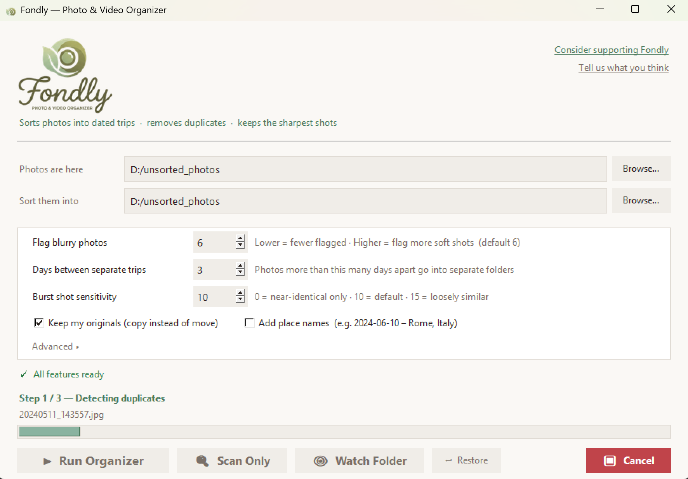
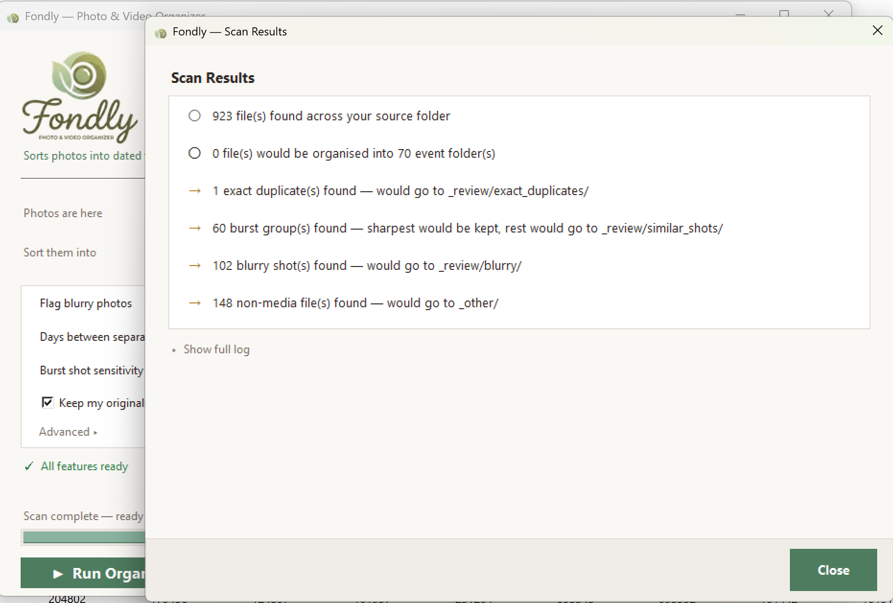

# Fondly — Photo & Video Organizer

**Stop dreading that hard drive full of 20 years of memories.**

Fondly automatically sorts your photos and videos into clean event folders, finds and removes duplicates, keeps the sharpest shot from every burst, and can even name folders after the place where the photos were taken — all without touching your originals.

[](https://buymeacoffee.com/techsetgrow)
[](https://github.com/techsetgrow/fondly-app/releases/latest)

---

## Download

**[⬇ Download the latest installer](https://github.com/techsetgrow/fondly-app/releases/latest)**

Double-click `FondlySetup-x.x.x.exe`, click through the wizard, and launch from your desktop shortcut. No Python or technical knowledge needed.

**Requirements:** Windows 10 or 11 (64-bit)

> The source code archives attached to each release are empty — Fondly's source is not publicly available. Download the installer above.

---

## What it does

Before Fondly your hard drive might look like this:

```
📁 Phone Backup 2019
📁 Vacation dump
📁 IMG_4821.jpg, IMG_4822.jpg, IMG_4822(1).jpg ...
```

After Fondly:

```
📁 2019-08-14 - Yellowstone, Wyoming
   📷 2019-08-14_001.jpg   ← sharpest burst shot kept
   📷 2019-08-14_002.jpg
   📁 videos/
   📁 _review/
      📁 similar_shots/
            IMG_4821_KEPT.jpg    ← copy of the kept shot, sorts with its group
            IMG_4822.jpg         ← weaker alternative
            IMG_4823.jpg         ← weaker alternative
      📁 blurry/                 ← out-of-focus photos
      📁 exact_duplicates/       ← byte-for-byte copies
📁 2019-12-25 - Home, Chicago
   ...
📁 _other/                       ← PDFs, documents, and other non-photo files
```

Everything in `_review` is yours to keep or delete — Fondly never makes that decision for you.

---

## Features

| Feature | What it means for you |
|---------|----------------------|
| **Smart event grouping** | Photos from the same trip or day land in the same folder automatically |
| **Location names from GPS** | Folder says "Rome, Italy" not just "2024-06-10" |
| **Duplicate removal** | Finds every identical copy — you only keep one |
| **Blur detection** | Blurry shots separated so you can decide what to delete. Portrait / bokeh shots (sharp subject, blurry background) are not affected. |
| **Burst shot triage** | Took 12 nearly-identical shots? Keeps the sharpest, sets the rest aside in a named folder so you can see exactly what was chosen and what wasn't |
| **Nothing deleted** | Everything goes to a `_review` folder or `_other` — you decide what to remove |
| **Undo any run** | Every run saves a restore point. Click Restore, pick a run from the list, and everything goes back exactly where it was. |
| **Copy mode** | Organise into a new folder without touching your original hard drive |
| **Watch folder** | Point it at your phone backup folder — it auto-organises as new photos arrive |
| **Rename files** | Files renamed to `2024-06-10_001.jpg` so they sort correctly everywhere |
| **Mixed content handled** | PDFs, documents, and other non-photo files move to `_other/` instead of being silently ignored |
| **Update notifications** | Fondly quietly checks for a new version on startup and shows a banner when one is available |

---

## Screenshots





---

## How to use it

1. **Download and install** using the link above
2. **Open Fondly** from your desktop shortcut
3. **Pick your source folder** — the messy hard drive or phone backup
4. **Pick an output folder** — where the sorted photos will go (can be empty)
5. Click **Scan Only** first to see a preview of what will happen
6. Click **Run Organizer** when you're happy

Every setting has a tooltip — just hover over it for a plain-English explanation.

---

## Frequently asked questions

**Will it delete my photos?**
No. Fondly only moves files to the output folder you choose. Nothing in your source folder is ever deleted. The `_review` subfolders hold anything flagged for your attention — you decide what to do with them.

**Can I undo it?**
Yes. Every run automatically saves a restore point inside your output folder (under `_fondly/`). Click **Restore**, pick a run from the list — it shows the date, file count, and folders — then confirm. Everything moves back exactly where it was.

**What if I just want to try it safely first?**
Tick **Keep my originals** and click **Scan Only** first. Copy mode leaves your originals completely untouched.

**Will it flag my portrait photos as blurry?**
No. Portrait and bokeh shots (sharp subject, blurry background) are not flagged. Fondly's blur detection targets camera-shake blur where the whole frame is soft.

**When burst shots are set aside, how do I know which one was kept?**
The alternatives go to `_review/similar_shots/` (one flat folder). A copy of the kept shot — named `IMG_0234_KEPT.jpg` — sits alongside them so they sort together and you can compare all versions at a glance.

**Does it need the internet?**
Only for the optional GPS location feature (uses OpenStreetMap — free, no account needed) and for checking whether a new version of Fondly is available. Everything else works fully offline.

**What file types does it support?**
Photos: JPG, PNG, HEIC, HEIF, TIFF, BMP, WEBP, RAW, CR2, NEF, ARW
Videos: MP4, MOV, AVI, MKV, M4V, WMV, FLV, 3GP, MTS, M2TS

---

## Support development

If Fondly saved you time, a coffee goes a long way.

[](https://buymeacoffee.com/techsetgrow)

Feature requests and bug reports welcome — open an issue above.

---

## License

MIT — free to use personally and commercially.
